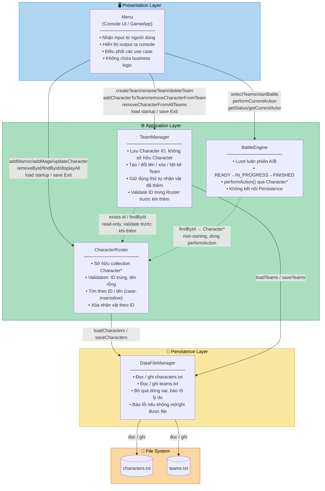

# TURN-BASED ADVENTURE GAME

Chương trình console mô phỏng trận đấu theo lượt giữa hai đội nhân vật (C++17), phát triển bằng Visual Studio.

---

## ⚙️ Môi trường & Công cụ Phát triển (bắt buộc)

Dự án được build và chạy **duy nhất bằng Visual Studio** (không còn hỗ trợ build đa nền tảng bằng Makefile/GCC như phiên bản trước). Toàn bộ thành viên trong nhóm cần dùng đúng bộ công cụ sau để tránh lỗi build khác nhau giữa các máy:

- **Chuẩn C++**: ISO C++17 (`/std:c++17`)
- **IDE**: Visual Studio 2022
- **Trình biên dịch (Compiler)**: MSVC v143 (đi kèm Visual Studio 2022)
- **Hệ điều hành**: Windows 10/11
- **Workload cần cài trong Visual Studio Installer**: *Desktop development with C++*, đảm bảo có tick thành phần **Google Test** (nằm trong danh sách component của workload này) — dùng cho `TurnBasedGameTestProject`.

---

## 📁 Cấu trúc Thư mục Dự án (hiện tại)

```text
TurnBasedGame/                          # Thư mục gốc — mở TurnBasedGame.sln đầu tiên
├── TurnBasedGame.sln                   # File solution
│
├── GameCore/                           # [Static Library project] Toàn bộ logic lõi (domain/model) của game
│   ├── data/                           # Dữ liệu mẫu (characters.txt, teams.txt, ...)
│   ├── model/                          # Các class: Character, Warrior, Mage, Team, Battle, ...
│   ├── framework.h                     # Sinh tự động khi tạo project (Static Library template)
│   ├── GameCore.cpp                    # Sinh tự động — thường không cần chỉnh sửa
│   ├── pch.h / pch.cpp                 # Precompiled header — sinh tự động
│   ├── GameCore.vcxproj
│   └── GameCore.vcxproj.filters
│
├── TurnBasedGameProject/               # [Console Application] Executable chính — Startup Project
│   └── TurnBasedGameProject.cpp        # main(), vòng lặp game (game loop), menu console
│
├── TurnBasedGameTestProject/           # [Google Test Project] Unit test cho GameCore
│   ├── test.cpp                        # Viết các TEST() / TEST_F() tại đây
│   ├── packages.config                 # Khai báo gói NuGet Google Test
│   └── pch.h / pch.cpp                 # Sinh tự động bởi template Google Test
│
├── packages/                           # Thư mục NuGet tự sinh khi restore — KHÔNG sửa tay, KHÔNG commit
├── .gitignore
├── .gitattributes
├── code_workflow.md                    # Quy trình làm việc nhóm (branch, commit, PR, ...)
└── README.md
```

> **Lưu ý**: `data/` và `model/` hiện đang thu gọn trong Solution Explorer nên README này chưa liệt kê chi tiết từng file bên trong — xem phần "Cần xác nhận thêm" ở cuối file.

---
## 🏛️ Kiến trúc Hệ thống

Hệ thống theo mô hình **3-Layer Architecture**. Sơ đồ bên dưới render được trực tiếp trên GitHub (qua Mermaid) và trong VS Code (qua extension PlantUML).



### Tóm tắt quan hệ giữa các layer

| Từ | Đến | Mô tả |
|---|---|---|
| Menu | CharacterRoster | CRUD nhân vật, load/save |
| Menu | TeamManager | CRUD team, load/save, cascade delete |
| Menu | BattleEngine | Điều khiển trận đấu, đọc trạng thái |
| TeamManager | CharacterRoster | Kiểm tra ID tồn tại trước khi thêm vào Team |
| BattleEngine | CharacterRoster | Lấy `Character*` để gọi `performAction()` |
| CharacterRoster | DataFileManager | Nạp / lưu characters.txt |
| TeamManager | DataFileManager | Nạp / lưu teams.txt |
| DataFileManager | File system | Đọc / ghi `.txt` |

---
## 🧩 Nơi đặt code (quan trọng nhất)

| Bạn cần viết...                                                            | Đặt vào project nào |
|---|---|
| Class nhân vật, logic trận đấu, team, dữ liệu, ... (toàn bộ business logic) | **`GameCore`** (`model/`, `data/`) |
| Vòng lặp game, menu console, gọi vào `GameCore` để chạy game               | **`TurnBasedGameProject`** |
| Test case cho các class trong `GameCore`                                   | **`TurnBasedGameTestProject`** (`test.cpp` hoac cac file .cpp khac) |

Quy tắc bắt buộc:

- **Toàn bộ logic nghiệp vụ (Character, Warrior, Mage, Team, Battle, đọc/ghi file, ...) phải nằm trong `GameCore`**, không viết trực tiếp trong `TurnBasedGameProject`. Lý do: `TurnBasedGameTestProject` chỉ tham chiếu (reference) được tới `GameCore` — một static library project — chứ không thể "với" vào file nằm trong project executable để test.
- `TurnBasedGameProject` chỉ nên chứa code liên quan tới trình bày/điều phối (console UI, `main()`), gọi xuống các class trong `GameCore`.
- Khi thêm file `.h`/`.cpp` mới vào `GameCore`, phải **Add vào project qua Solution Explorer** (chuột phải vào `model/` hoặc `data/` → Add → New Item / Existing Item) để Visual Studio biên dịch file đó — chỉ copy file vào thư mục trên ổ đĩa mà không Add vào project thì file sẽ **không** được build.

---

## 🛠️ Hướng dẫn Build và Run trong Visual Studio

### 1. Cài đặt môi trường
Mở **Visual Studio Installer**, đảm bảo đã cài workload **Desktop development with C++**, và trong danh sách component của workload này có tick **Google Test**.

### 2. Mở solution
Clone repo, mở file `TurnBasedGame.sln` bằng Visual Studio 2022 (double-click file, hoặc File > Open > Project/Solution).

### 3. Khôi phục gói NuGet (cho `TurnBasedGameTestProject`)
Visual Studio thường tự động restore gói Google Test khi build, nếu tuỳ chọn "Allow NuGet to download missing packages" đang bật (mặc định có sẵn). Nếu build báo thiếu gói: chuột phải vào **Solution** trong Solution Explorer → **Restore NuGet Packages**.

### 4. Đặt Startup Project và chạy game
Chuột phải vào **`TurnBasedGameProject`** trong Solution Explorer → **Set as Startup Project**. Sau đó:
- `Ctrl + F5` để chạy game (Start Without Debugging), hoặc
- `F5` để chạy kèm debug.

### 5. Build toàn bộ solution
`Ctrl + Shift + B`, hoặc menu **Build > Build Solution**.

### 6. Chạy Unit Test
Mở **Test > Test Explorer**. Sau khi build, các `TEST()` / `TEST_F()` viết trong `TurnBasedGameTestProject/test.cpp` sẽ tự động được liệt kê. Bấm **Run All Tests**, hoặc chọn từng test để chạy riêng.

### 7. Kiểm tra cấu hình chuẩn C++17 (nên kiểm tra 1 lần cho mỗi project)
Với cả 3 project (`GameCore`, `TurnBasedGameProject`, `TurnBasedGameTestProject`): chuột phải vào project → Properties →
- `Configuration Properties > C/C++ > Language > C++ Language Standard` → chọn **ISO C++17 Standard (/std:c++17)**
- `Configuration Properties > General > Platform Toolset` → chọn **Visual Studio 2022 (v143)**

---

## 👥 Quy trình làm việc nhóm

Xem chi tiết quy trình git/branch/commit tại [`code_workflow.md`](./code_workflow.md).

---

