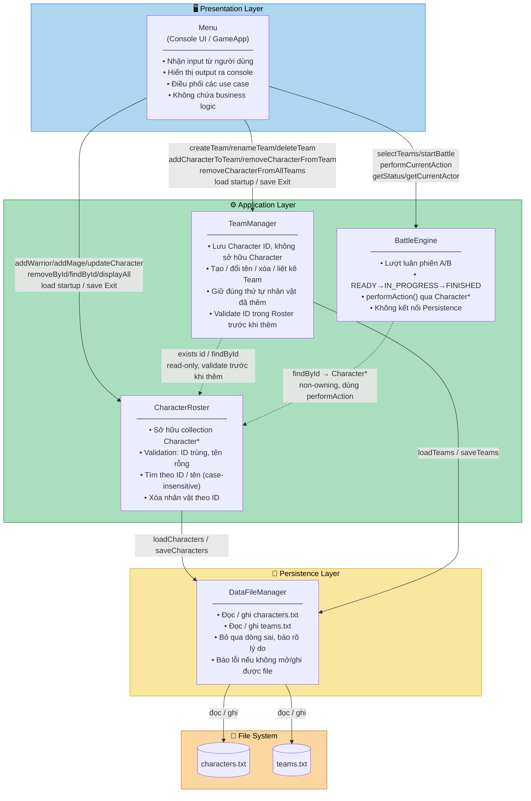

# TURN-BASED ADVENTURE GAME MOCK PROJECT

Chương trình console mô phỏng trận đấu theo lượt giữa hai đội nhân vật (C++11).

## ⚙️ Môi trường & Công cụ Phát triển (Compiler & IDE Specs)
Để đảm bảo nhất quán cho tất cả thành viên trong nhóm khi build và chạy code:
- **Chuẩn C++**: ISO C++17 (`-std=c++17` đối với GCC / `/std:c++17` đối với MSVC).
- **Trình biên dịch (Compiler)**:
  - GCC / MinGW g++ 7.0 trở lên (Linux / Windows MinGW).
  - MSVC v143 (Microsoft Visual C++ đi kèm Visual Studio 2022).
- **IDE / Editor khuyên dùng**: Visual Studio 2022, VS Code (với C/C++ Extension Pack), CLion.
- **Hệ điều hành**: Windows 10/11, Linux, macOS.

---

## 📁 Cấu trúc Thư mục Dự án
```text
TurnBasedGame/
├── include/       # Header files (.h) - Chứa định nghĩa Lớp & Interface
├── src/           # Implementation files (.cpp) - Chứa hiện thực phương thức
├── data/          # File dữ liệu mẫu (characters.txt, teams.txt)
├── tests/         # Test cases & unit tests
├── Makefile       # Biên dịch bằng GCC / MinGW g++
├── .gitignore     # Loại bỏ các file rác build Visual Studio & GCC
├── README.md      # Tài liệu hướng dẫn & quy chuẩn nhóm
└── main.cpp       # Điểm khởi chạy chính của ứng dụng
```

---

## 🏛️ Kiến trúc Hệ thống

Hệ thống theo mô hình **3-Layer Architecture**. Sơ đồ bên dưới render được trực tiếp trên GitHub (qua Mermaid) và trong VS Code (qua extension PlantUML).



### Tóm tắt quan hệ giữa các layer

| Từ | Đến | Mô tả |
|---|---|---|
| Menu | CharacterRoster | CRUD nhân vật, load/save |
| Menu | TeamManager | CRUD team, load/save, cascade delete |
| Menu | BattleEngine | Điều khiển trận đấu, đọc trạng thái |
| TeamManager | CharacterRoster | Kiểm tra ID tồn tại trước khi thêm vào Team |
| BattleEngine | CharacterRoster | Lấy `Character*` để gọi `performAction()` |
| CharacterRoster | DataFileManager | Nạp / lưu characters.txt |
| TeamManager | DataFileManager | Nạp / lưu teams.txt |
| DataFileManager | File system | Đọc / ghi `.txt` |

---

## 🛠️ Hướng dẫn Biên dịch và Chạy

### 1. Biên dịch bằng GCC (g++ / Makefile)
```bash
make
./TurnBasedGame
```

### 2. Biên dịch bằng Visual Studio (MSVC)
1. Mở file solution `TurnBasedGame.slnx` hoặc `TurnBasedGame.vcxproj`.
2. Bấm `Ctrl + F5` để Build và Run dự án.

---